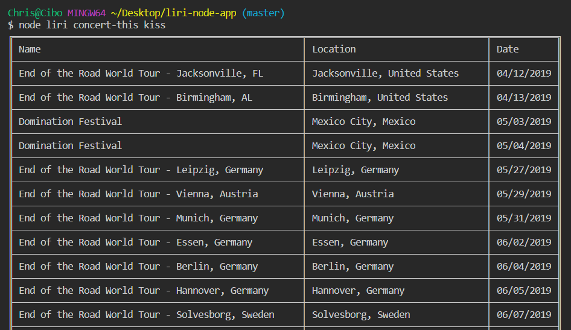
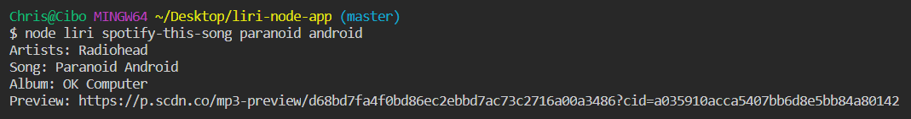
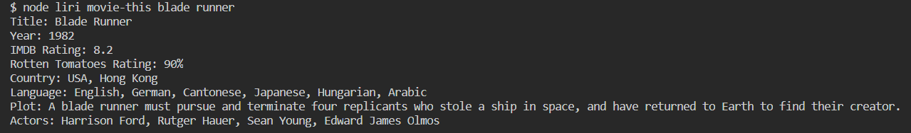
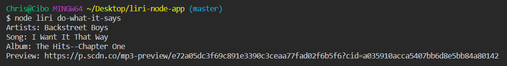

# LIRI

LIRI (**L**anguage **I**nterpretation and **R**ecognition **I**nterface) is a command line assistant inspired by Apple's Siri.

Liri can:

- Look for upcoming concerts
- Find information about a song
- Lookup information about a movie
- Read commands stored in a file

## Usage

### Search for concerts

`node liri concert-this <artist>`

### Search for a song

`node liri spotify-this-song <song>`

### Search for a movie

`node liri movie-this <movie>`

### Read commands from file

`node liri do-what-it-says`

## Technology Stack

- Node.js
- Libraries
  - [Axios](https://www.npmjs.com/package/axios)
  - [Moment](https://www.npmjs.com/package/moment)
  - [Node Spotify API](https://www.npmjs.com/package/node-spotify-api)
  - [Table](https://www.npmjs.com/package/table)
- [BandsinTown API](https://www.artists.bandsintown.com/bandsintown-api)
- [OMDb API](https://www.omdbapi.com)
