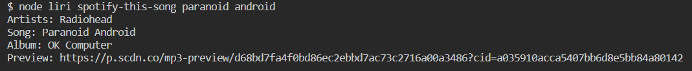
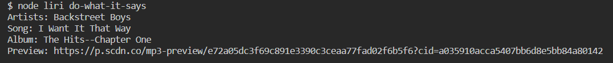

# LIRI Bot

LIRI (**L**anguage **I**nterpretation and **R**ecognition **I**nterface)

A command line assistant.

## Usage

### Search for concerts

`node liri concert-this <artist>`

### Search for a song

`node liri spotify-this-song <song>`

### Search for a movie

`node liri movie-this <movie>`

### Read commands from file

`node liri do-what-it-says`

